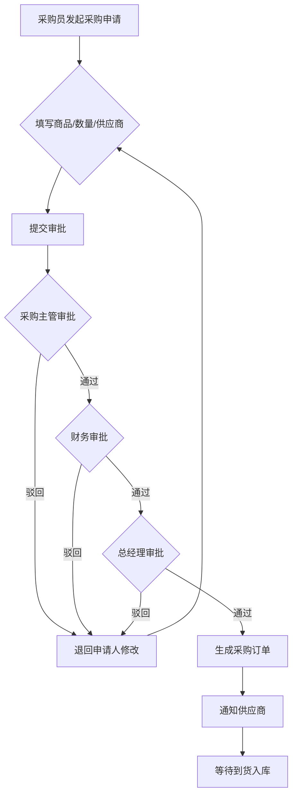
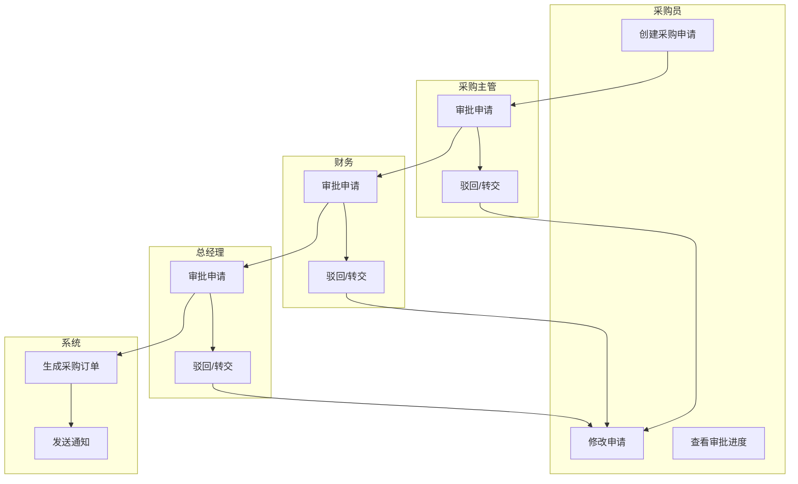
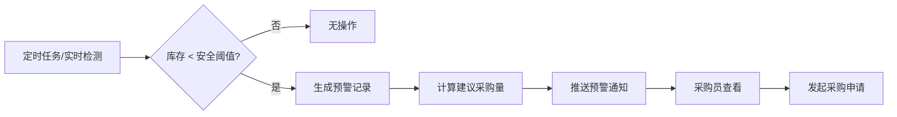
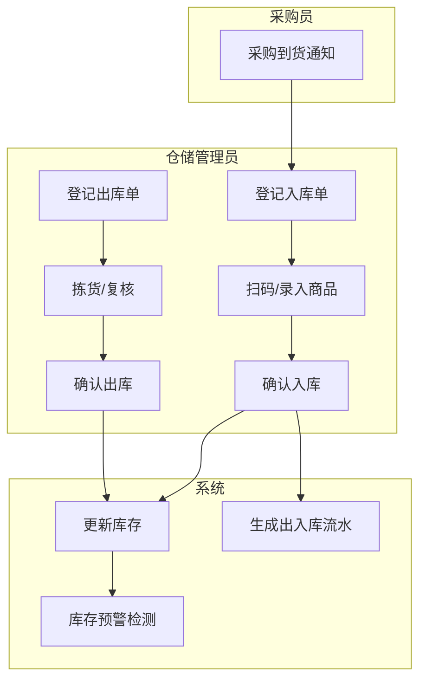
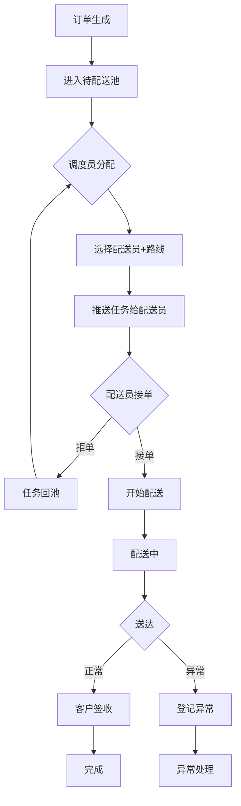
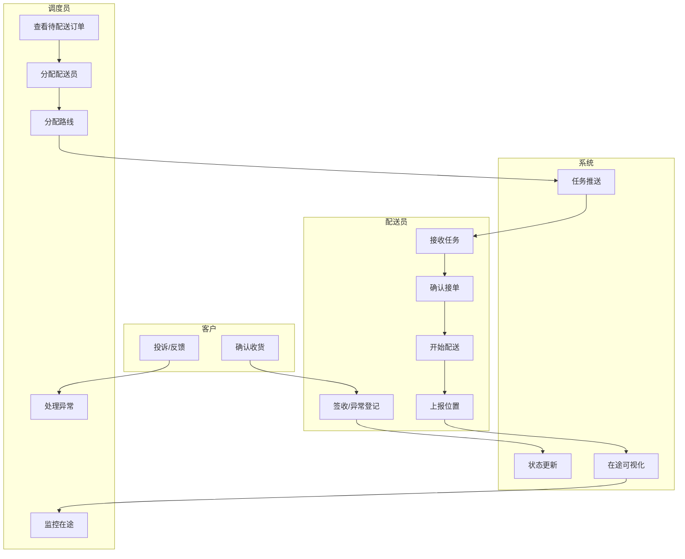
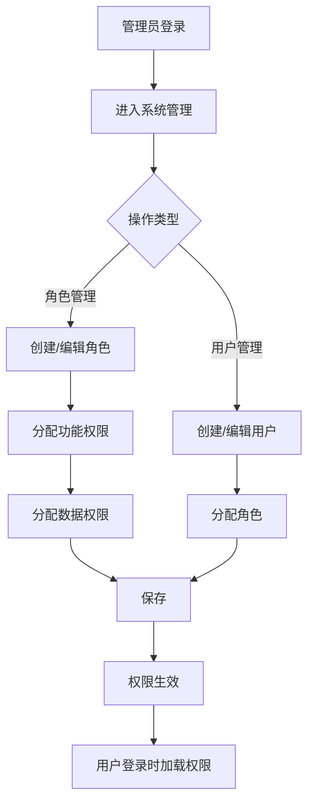
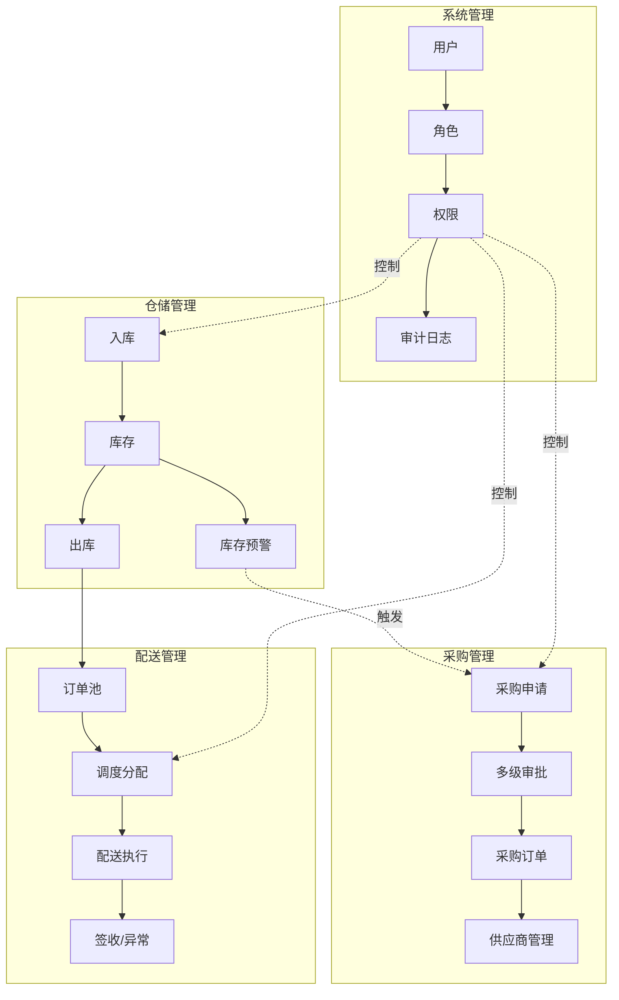

# 生鲜超市物流配送系统 - 业务流程图与泳道图

---

## 一、采购审批业务流程图

```mermaid
flowchart TD
    A[采购员发起采购申请] --> B{填写商品/数量/供应商}
    B --> C[提交审批]
    C --> D{采购主管审批}
    D -->|驳回| E[退回申请人修改]
    E --> B
    D -->|通过| F{财务审批}
    F -->|驳回| E
    F -->|通过| G{总经理审批}
    G -->|驳回| E
    G -->|通过| H[生成采购订单]
    H --> I[通知供应商]
    I --> J[等待到货入库]
```

---

## 二、采购审批泳道图

```mermaid
flowchart TB
    subgraph 采购员
        A1[创建采购申请]
        A2[修改申请]
        A3[查看审批进度]
    end
    
    subgraph 采购主管
        B1[审批申请]
        B2[驳回/转交]
    end
    
    subgraph 财务
        C1[审批申请]
        C2[驳回/转交]
    end
    
    subgraph 总经理
        D1[审批申请]
        D2[驳回/转交]
    end
    
    subgraph 系统
        E1[生成采购订单]
        E2[发送通知]
    end
    
    A1 --> B1
    B1 --> B2
    B1 --> C1
    C1 --> C2
    C1 --> D1
    D1 --> D2
    D1 --> E1
    E1 --> E2
    B2 --> A2
    C2 --> A2
    D2 --> A2
```

---

## 三、库存预警与采购建议流程图

```mermaid
flowchart LR
    A[定时任务/实时检测] --> B{库存 < 安全阈值?}
    B -->|否| C[无操作]
    B -->|是| D[生成预警记录]
    D --> E[计算建议采购量]
    E --> F[推送预警通知]
    F --> G[采购员查看]
    G --> H[发起采购申请]
```

---

## 四、仓储出入库泳道图

```mermaid
flowchart TB
    subgraph 采购员
        P1[采购到货通知]
    end
    
    subgraph 仓储管理员
        W1[登记入库单]
        W2[扫码/录入商品]
        W3[确认入库]
        W4[登记出库单]
        W5[拣货/复核]
        W6[确认出库]
    end
    
    subgraph 系统
        S1[更新库存]
        S2[库存预警检测]
        S3[生成出入库流水]
    end
    
    P1 --> W1
    W1 --> W2
    W2 --> W3
    W3 --> S1
    S1 --> S2
    W3 --> S3
    
    W4 --> W5
    W5 --> W6
    W6 --> S1
```

---

## 五、配送调度业务流程图

```mermaid
flowchart TD
    A[订单生成] --> B[进入待配送池]
    B --> C{调度员分配}
    C --> D[选择配送员+路线]
    D --> E[推送任务给配送员]
    E --> F{配送员接单}
    F -->|拒单| G[任务回池]
    G --> C
    F -->|接单| H[开始配送]
    H --> I[配送中]
    I --> J{送达}
    J -->|正常| K[客户签收]
    J -->|异常| L[登记异常]
    K --> M[完成]
    L --> N[异常处理]
```

---

## 六、配送管理泳道图

```mermaid
flowchart TB
    subgraph 调度员
        D1[查看待配送订单]
        D2[分配配送员]
        D3[分配路线]
        D4[监控在途]
        D5[处理异常]
    end
    
    subgraph 配送员
        R1[接收任务]
        R2[确认接单]
        R3[开始配送]
        R4[上报位置]
        R5[签收/异常登记]
    end
    
    subgraph 客户
        C1[确认收货]
        C2[投诉/反馈]
    end
    
    subgraph 系统
        S1[任务推送]
        S2[状态更新]
        S3[在途可视化]
    end
    
    D1 --> D2
    D2 --> D3
    D3 --> S1
    S1 --> R1
    R1 --> R2
    R2 --> R3
    R3 --> R4
    R4 --> S3
    S3 --> D4
    R5 --> S2
    C1 --> R5
    C2 --> D5
```

---

## 七、角色权限管理流程图

```mermaid
flowchart TD
    A[管理员登录] --> B[进入系统管理]
    B --> C{操作类型}
    C -->|角色管理| D[创建/编辑角色]
    D --> E[分配功能权限]
    E --> F[分配数据权限]
    F --> G[保存]
    C -->|用户管理| H[创建/编辑用户]
    H --> I[分配角色]
    I --> G
    G --> J[权限生效]
    J --> K[用户登录时加载权限]
```

---

## 八、整体业务架构图

```mermaid
flowchart TB
    subgraph 采购管理
        P1[采购申请] --> P2[多级审批]
        P2 --> P3[采购订单]
        P3 --> P4[供应商管理]
    end
    
    subgraph 仓储管理
        W1[入库] --> W2[库存]
        W2 --> W3[出库]
        W2 --> W4[库存预警]
        W4 -.->|触发| P1
    end
    
    subgraph 配送管理
        D1[订单池] --> D2[调度分配]
        D2 --> D3[配送执行]
        D3 --> D4[签收/异常]
    end
    
    subgraph 系统管理
        S1[用户] --> S2[角色]
        S2 --> S3[权限]
        S3 --> S4[审计日志]
    end
    
    W3 --> D1
    S3 -.->|控制| P1
    S3 -.->|控制| W1
    S3 -.->|控制| D2
```
