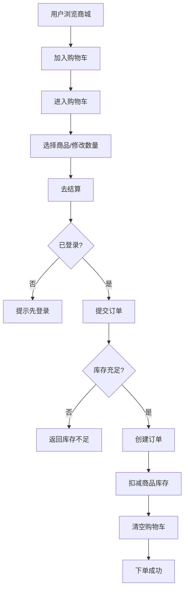
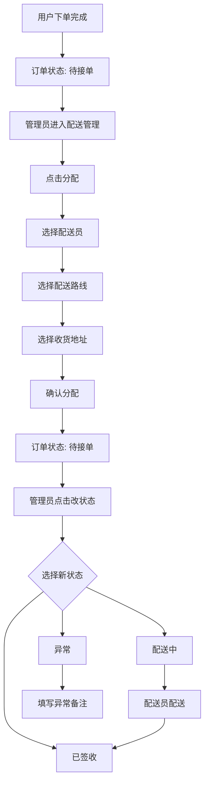
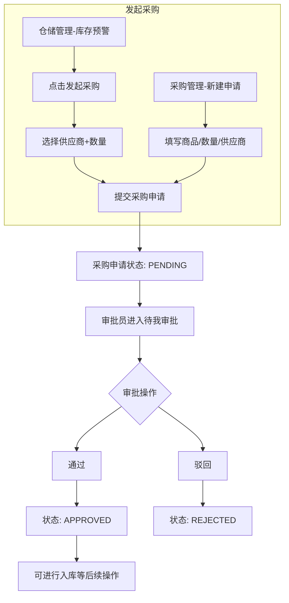
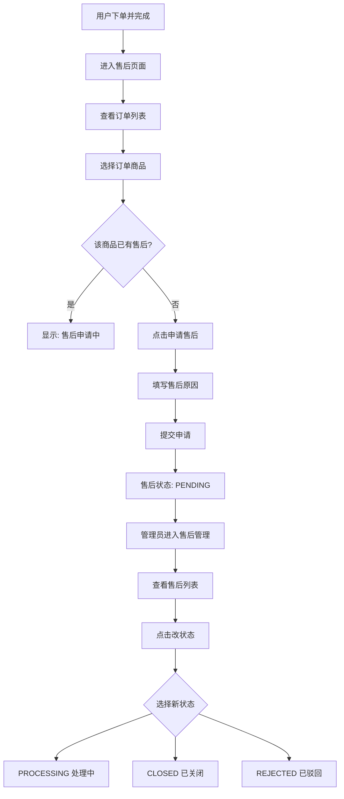
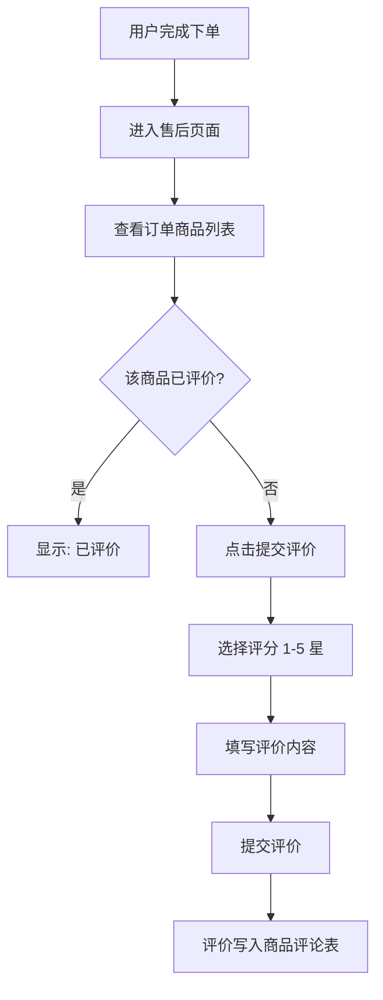
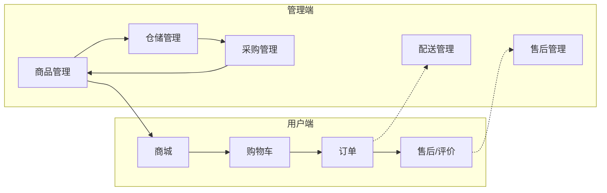
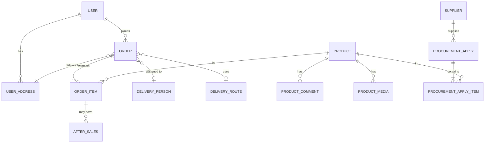

# 生鲜超市物流配送系统 - 业务流程说明

## 一、用户下单流程

用户浏览商品 → 加入购物车 → 结算 → 创建订单 → 扣减库存



**关键步骤：**
- 购物车数据存于前端 localStorage
- 下单时校验：商品存在、库存充足、用户已登录
- 事务内完成：创建订单 + 写入订单明细 + 扣减库存
- 订单初始配送状态：`PENDING_ACCEPT`（待接单）

---

## 二、配送流程

管理员分配配送资源 → 更新配送状态



**配送状态流转：**
```
PENDING_ACCEPT(待接单) → IN_DELIVERY(配送中) → DELIVERED(已签收)
                    ↘ EXCEPTION(异常)
```

---

## 三、采购流程

库存预警 / 手动申请 → 采购申请 → 审批 → 通过/驳回



**采购申请来源：**
1. **仓储发起**：库存低于安全库存时，在仓储管理页点击「发起采购」
2. **采购页发起**：在采购管理「新建申请」中手动创建

**审批权限：** ADMIN、APPROVER 角色可审批

---

## 四、售后流程

用户申请售后 → 管理员处理



**约束：** 同一订单明细（orderItemId）在 PENDING 或 PROCESSING 状态下不可重复申请

---

## 五、商品评价流程

用户下单后对商品进行评价



**约束：** 仅下单用户可评价，且每个商品每个用户只能评价一次（前端根据 commented-by-user 判断）

---

## 六、整体业务关系图



---

## 七、核心数据表关系


